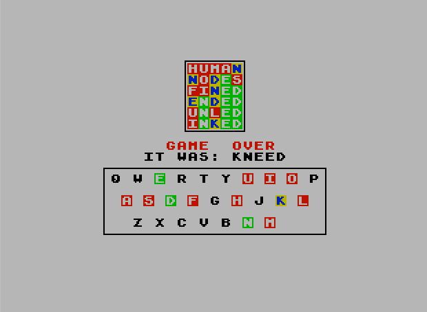
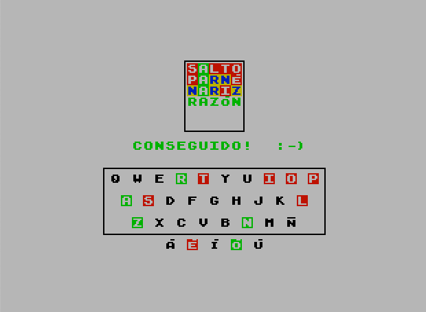

# ZX GUORDEL

---

Select your desired language / Elija idioma:

- Click [this link for English](#english)

- Pulse [este enlace para Castellano](#castellano)

---

## English

ZX GUORDEL is a word discovery game, for ZX Spectrum (48K or better) and its derivatives, inspired by [Wordle](https://www.nytimes.com/games/wordle/index.html). Wordle is an idea and original creation by [Josh Wardle](https://powerlanguage.co.uk), the game name is a play on his surname.

### Loading instructions

You can obtain the latest version of the game from the releases page, following [this link](https://github.com/kounch/guordel/releases/latest). There are distribution files in three differente formats: tape for classic ZX Spectrum (normal `.tap` and turbo `.tzx` or `.pzx`), files for [esxdos](http://esxdos.org), and files for [ZX Spectrum Next](https://www.specnext.com). All these are available in several languages.

#### Tape

Type LOAD"" and "Enter", and start the tape.

#### esxdos firmware

Copy the uncompressed contents of the ZIP file labelled for esxdos to the storage card.

With the device turned off, insert the card and turn on the computer. Make sure that esxdos initializes correctly.

Browse to the directory where the files are and run the program `GUORDEL.BAS`, either from the command line, or using a file browser, to start the game.

#### ZX Spectrum Next and clones

Extract the contents of the ZIP file labelled for ZX Spectrum Next to the SD card.

With the device turned off, insert the SD card and turn on the computer. For compatible computers, be sure to boot up with the ZX Spectrum Next core.

Browse to the directory where the files are and run the program `guordel.bas` from within the directory where the extracted files are, to start the game.

### How to play

Guess the hidden word in six tries. Each guess must be a valid five-letter word. After each guess, the colour of the letters will change to show how close your guess was. Letters marked with green are in the word and in the correct spot. Letters marked with yellow are in the word but in the wrong spot. Letters marked with red aren`t in the word in any spot.

On hard mode, any revealed and correct hint (marked with green) must be used in the right spot in subsequent guesses.

Use the letters of the keyboard to type your word, and `Caps Shift` and `0` to delete a typed key. Hit the `Enter` key when ready to guess.

Game statistics are kept. On the tape version they can be saved manually, and they are stored automatically on all the other versions.

### Examples

The letter `W` is in the word and in the correct spot.

The letter `I` is in the word but in the wrong spot.

The letter `U` is not in the word in any spot.

### How to customize the word list

A Python script (version 3.6 or later) is included, which can make two data files which can be used to customize the word and solutions data.

Please take note of the maximum size limits for the word data (19967 bytes) and solutions data (4856 bytes). If the files are bigger than that, the game won't work properly.

#### Arguments

    -h, --help                  Show help
    -v, --version               Show program's version number and exit
    -i INPUT_WORDS, --input_words INPUT_WORDS
                                Source text file with words
    -o OUTPUT_WORDS, --output_words OUTPUT_WORDS
                                Destination binary file with packed words
    -I INPUT_SOLUTIONS, --input_solutions INPUT_SOLUTIONS
                                Source text file with solutions
    -O OUTPUT_SOLUTIONS, --output_solutions OUTPUT_SOLUTIONS
                                Destination binary file with packed solutions

#### Use example

Having a file named `words_en.txt` with all the valid words, and another file named `wordss_en.txt` with all the possible solutions (which have to be a part or subset of the valid words list), use a command like this to make two new files named `words` and `wordss`:

    python3 ...make_words.py -i words_en.txt -o wordss -I wordss_en.txt -O wordss

Now you can use the data in this files instead of the original. When working with esxdos or ZX Spectrum Next versions, simply replace the old files with the new ones. For the tape (`.tap`) release, you have to replace the corresponding byte blocks (CODE) with the new data, keeping this structure:

    Program: guordel (autostart:10)
    Bytes: guordel (start addr:35840)
    Bytes: font (start addr:38400)
    Bytes: words (start addr:44032)
    Bytes: wordss (start addr:39168)
    Program: basic (autostart:10)

The `.tap` file can be modified with any of the various programs that exist ([bin2tap](https://sourceforge.net/p/zxspectrumutils/wiki/bin2tap/), [tapir](https://www.alessandrogrussu.it/tapir/index.html), [ZX-BlockEditor](https://web.archive.org/web/20210411174258/https://zx-modules.de/?page_id=2), etc.).

### Memory map

Reserved Spaces

    35840-38399 (2.5K bytes) Compiled C binary code
    38400-39167 (768 bytes) Custom font
    39168-43839 (4672 bytes) Solutions list
    43840-43896 (56 bytes) Statistics/Scores
    43897-43901 (5 bytes) Word Letters
    43902-43903 (2 bytes) Word Number
    43904-63999 (20096 bytes) Word Dictionary
    64000-65536 (1.5K) Reserved for UGDs and C binary stack needs

### Word packing

Word packing algorithm based on [this blog post](http://alexanderpruss.blogspot.com/2022/02/game-boy-wordle-how-to-compress-12972.html?m=1)

1. Divide the word list n lists, based on the first letter of the word. Since in each list, the first letter is the same, we now need only store four letters per word, along with some overhead for each list.

2. Each four letter “word” (or tail of a word) can be stored with 5 bits per letter, thereby yielding a 20 bit unsigned integer. If we stop here, we can store each word in 2.5 bytes.

3. As each of the lists of four letter “words”, is in alphabetical order, and encoded the natural way as 20 bit numbers, the numbers will be in ascending order. Instead of storing these numbers, we need only store their arithmetical differences.

4. Store a stream of bytes encoding the difference. Each number is encoded as one, two or three bytes. This way, a list of 12947 words (64375 bytes) can be stored in less than 20K.

### Word lists

The releases are using word lists obtained from these sources:

[Spanish](https://wordle.danielfrg.com)

[English](https://www.nytimes.com/games/wordle/index.html)

---

## Castellano

ZX GUORDEL es un juego de descubrimiento de palabras, para ZX Spectrum (48K o superior) y derivados, inspirado en [Wordle](https://www.nytimes.com/games/wordle/index.html). Wordle, como tal, es una idea y creación original de [Josh Wardle](https://powerlanguage.co.uk), de cuyo apellido se deriva el nombre del juego.

### Instrucciones de carga

Puede obtener la última versión del juego, siguiendo [este enlace](https://github.com/kounch/guordel/releases/latest). Hay ficheros para descargar en tres formatos distintos: cinta (`.tap` normal y `.tzx` o `.pzx` turbo) para ZX Spectrum clásico, archivos para [esxdos](http://esxdos.org), y archivos para [ZX Spectrum Next](https://www.specnext.com). Además estos están en varios idiomas.

#### Cinta

Use LOAD"" y "Enter", y ponga en marcha la cinta.

#### esxdos

Copie en el lugar que desee de la tarjeta de almacenamiento el contenido descomprimido del fichero ZIP marcado como para esxdos.

Con el equipo apagado, inserte la tarjeta y encienda el ordenador. Asegúrese de arrancar correctamente con esxdos.

Navegue hasta el directorio donde estén los ficheros y ejecute el programa `GUORDEL.BAS` desde la línea de comandos o desde algún navegador de archivos para iniciar el juego.

#### ZX Spectrum Next

Copie en el lugar que desee de la tarjeta SD el contenido descomprimido del fichero ZIP marcado para ZX Spectrum Next.

Con el equipo apagado, inserte la tarjeta SD y encienda el ordenador. Para equipos compatibles, asegúrese de arrancar con el core de ZX Spectrum Next.

Ejecute el programa `guordel.bas`, dentro del directorio donde se hayan copiado los ficheros, para arrancar el juego.

### Cómo jugar

Adivine la palabra oculta en seis intentos. Cada intento debe ser una palabra válida de 5 letras. El color de las letras indica lo cerca que se está de acertar la palabra. Las letras marcadas con color verde están en la palabra y en la posición correcta. Las letras marcadas con color amarillo están en la palabra, pero en una posición incorrecta. Las letras marcadas con color rojo no están en la palabra.

En el modo difícil, las letras reveladas y correctas (marcadas con verde) se han de utilizar en la posición correcta en intentos posteriores.

Utilice las letras del teclado para escribir la palabra. Use la tecla de espacio para escribir la `Ñ` y la tecla `Symbol Shift` junto con una tecla de vocal para acentuarla. Use `Caps Shift` junto con `0` para borrar. Pulse la tecla `Enter` al finalizar.

Se guardan estadísticas de las partidas jugadas, que se pueden guardar manualmente en la versión de cinta, y se almacenan automáticamente en resto de versiones.

### Ejemplos

La letra `G` está en la palabra y en la posición correcta.

La letra `C` está en la palabra, pero en una posición incorrecta.

La letra `O` no está en la palabra.

### Cómo personalizar la lista de palabras

Se incluye un script de Python (versión 3.6 o superior) que sirve para crear dos ficheros de datos que se pueden usar para sustituir los datos de palabras y soluciones por otros personalizados.

Notar los límites de tamaño máximo para la lista de palabras (19967 bytes) y de soluciones (4856 bytes). Si los ficheros generados superan estos límites, el juego no funciona correctamente.

#### Argumentos

    -h, --help                   Mostrar ayuda
    -v, --version                Mostrar la versión del script
    -i INPUT_WORDS, --input_words INPUT_WORDS
                                 Fichero de texto con todas las palabras válidas
    -o OUTPUT_WORDS, --output_words OUTPUT_WORDS
                                 Fichero de destino para las palabras
    -I INPUT_SOLUTIONS, --input_solutions INPUT_SOLUTIONS
                                 Ficheo de texto con todas las posibles palabras a preguntar (soluciones)
    -O OUTPUT_SOLUTIONS, --output_solutions OUTPUT_SOLUTIONS
                                 Fichero de destino para las soluciones

#### Ejemplo de uso

Teniendo un fichero `words_es.txt` con todas las palabras válidas y otro fichero `wordss_es.txt` con las posibles soluciones (que tienen que ser obligatoriamente una parte o subconjunto de la lista de palabras válidas), usar un comando como el siguiente para generar dos ficheros llamados `words` y `wordss`:

    python3 ...make_words.py -i words_es.txt -o wordss -I wordss_es.txt -O wordss

Ahora se deben de utilizar los datos de estos dos ficheros en vez los que vienen incluidos. En el caso de la versión para esxdos o ZX Spectrum Next, simplemente hay que reemplazarlos. En la versión en cinta (`.tap`) se han de reemplazar los bloques correspondientes del tipo bytes (CODE) con los nuevos datos, quedando esta estructura:

    Program: guordel (autostart:10)
    Bytes: guordel (start addr:35840)
    Bytes: font (start addr:38400)
    Bytes: words (start addr:44032)
    Bytes: wordss (start addr:39168)
    Program: basic (autostart:10)

El fichero `.tap` se puede modificar con cualquiera de los múltiples programas que existen para ello ([bin2tap](https://sourceforge.net/p/zxspectrumutils/wiki/bin2tap/), [tapir](https://www.alessandrogrussu.it/tapir/index.html), [ZX-BlockEditor](https://web.archive.org/web/20210411174258/https://zx-modules.de/?page_id=2), etc.).

### Mapa de memoria

Estos son los espacios reservados en la memoria RAM para los distintos datos del juego, sin contar la parte hecha con Sinclair BASIC.

    35840-38399 (2.5K bytes) Código binario compilado desde C
    38400-39167 (768 bytes) Fuente personalizada
    39168-43839 (4672 bytes) Lista de soluciones
    43840-43896 (56 bytes) Estadísticas y puntuaciones
    43897-43901 (5 bytes) Letras de la palabra
    43902-43903 (2 bytes) Número de palabra
    43904-63999 (20096 bytes) Diccionario de palabras
    64000-65536 (1.5K) Reservado para UDGs y la pila del binario compilado

### Empaquetado de las palabras

El algoritmo de empaquetado está basado en lo que se cuenta [en esta entrada de blog](http://alexanderpruss.blogspot.com/2022/02/game-boy-wordle-how-to-compress-12972.html?m=1)

1. Dividir la lista de palabras en n listas, basadas en la primera letra de la palabra. Como en cada lista la primera letra es la misma, sólo tenemos que almacenar cuatro letras por palabra, con un pequeño extra para cada lista.

2. Cada "palabra" de cuatro letras, se puede almacenar usando 5 bits por letra, obteniendo un número entero de 20 bit. Con esto, cada palabra ocuparía 2,5 bytes.

3. Como cada una de las listas de "palabras" de cuatro letras está en orden alfabético, y codificadas como número de 20 bit en orden natural, los números estará en orden ascendente. En lugar de almacenar los números, sólo necesitamos la diferencia aritmética entre dos consecutivos.

4. Se almacenan como bytes las diferencias. Cada diferencia se codifica usando uno, dos o tres bytes, según su tamaño. De esta manera, una lista de 11519 palabras en castellano (57505 bytes) se puede guardar en menos de 17K.

### Listas de palabras

Las versiones existentes utilizan listas de palabras obtenidas de estas fuentes:

[Castellano](https://wordle.danielfrg.com)

[Inglés](https://www.nytimes.com/games/wordle/index.html)

---

## Copyright

Copyright (c) 2022 kounch

Permission to use, copy, modify, and/or distribute this software for any purpose with or without fee is hereby granted, provided that the above copyright notice and this permission notice appear in all copies.

THE SOFTWARE IS PROVIDED "AS IS" AND THE AUTHOR DISCLAIMS ALL WARRANTIES WITH REGARD TO THIS SOFTWARE INCLUDING ALL IMPLIED WARRANTIES OF MERCHANTABILITY AND FITNESS. IN NO EVENT SHALL THE AUTHOR BE LIABLE FOR ANY SPECIAL, DIRECT, INDIRECT, OR CONSEQUENTIAL DAMAGES OR ANY DAMAGES WHATSOEVER RESULTING FROM LOSS OF USE, DATA OR PROFITS, WHETHER IN AN ACTION OF CONTRACT, NEGLIGENCE OR OTHER TORTIOUS ACTION, ARISING OUT OF OR IN CONNECTION WITH THE USE OR PERFORMANCE OF THIS SOFTWARE

Spectrum Turboloader by Esben Krag Hansen (from Your Sinclair, May 1986)
